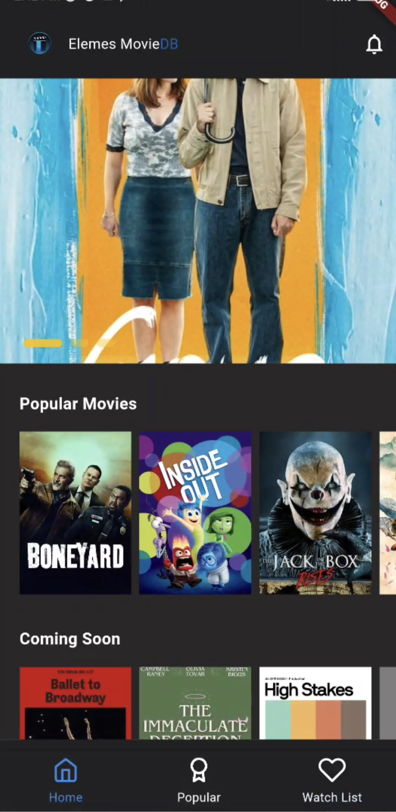

# Elemes Movie DB

Simple application for movie database

---

> **Cara menjalankan projek ini:**
>

Di projek ini, kita akan berkenalan dengan aplikasi movie db, seperti list movie terkini, search movie , dan ada fitur menambahkan movie ke watch list.

## Menjalankan Aplikasi Flutter

Untuk menjalankan aplikasi Flutter di sistem operasi android menggunakan emulator, kita perlu memastikan dulu apakah android sdk sudah terinstall di laptop kita. Cara cek nya adalah dengan mengetikan perintah berikut pada terminal:

```bash
flutter doctor -v
```


Gambar 4. Android Toolchain error di dalam perintah flutter doctor

Bila android toolchain belum centang hijau, ada beberapa langkah yang perlu dilakukan. Langkahnya sebagai berikut:

### 1. Download Android Studio dan Install

Software android studio bisa anda download dari link dibawah. Setelah selesai download, lalu install. Android studio disini akan menjadi tools untuk me manage android emulator. https://developer.android.com/studio


Gambar 5. Download Android Studio

### 2. Buka Android Studio

Setelah android studio dibuka, klik More Actions lalu klik virtual device manager.


Gambar 6 Android Studio - Virtual Device Manager

### 3. Pilih Device

Selanjutnya kita diminta untuk memasukan tipe phone


Gambar 7. Add Device - Select Hardware

### 4. Pilih System Image

Setelah itu pilih system image Android. Download bila belum pernah download. Pastikan internet lancar karena akan download file yang besar. Next sampai Virtual Device terbentuk.


Gambar 8. Pilih System Image

### 5. Masuk Android Studio, Klik More Actions, Pilih SDK Manager


Gambar 9. SDK Manager

### 6. Pilih Tab SDK Tools, centang Android SDK Command-line

Kemudian setelah berhasil download, kembali ke terminal kembali untuk check apakah android sdk nya siap untuk di konsumsi.


### 7. Menerima Lisensi Android

Jalankan perintah

```bash
flutter doctor --android-licenses
```

Selanjutnya ketik y enter sampai selesai


Gambar 11. Android Licenses Accepted

### 8. Buka Project yang Sudah Dibuat dengan VS Code

Disini kita akan melihat struktur folder dan pilihan device yang akan kita gunakan.

1. Buka lib/main.dart terlebih dahulu

2. kemudian pilih Device di toolbar (default Windows), nanti akan muncul daftar emulator.

3. Pilih salah satu emulator.


Gambar 12. Pilih Emulator

### 9. Pilih Device dan Run aplikasi

Setelah memilih device, kita dapat lanjut dengan cara klik menu Run dilanjut button run without debugging


Gambar 13. Run Without Debugging

### 10. Aplikasi berhasil dijalankan

Selanjutnya bila tidak ada problem, maka aplikasi akan tampil di emulator yang sebelumnya sudah kita pilih.



Gambar 14. Aplikasi Berjalan